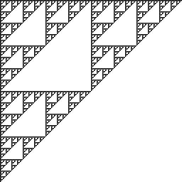

# sierpgm
A simple C program that takes an integer argument and generates a .pgm image containing the resulting Sierpiński triangle after that many iterations. The filesize of the resulting image is quadrupled for each iteration, so it's not recommended to give a very large argument. 10 iterations will result in a 1MB image. The image resolution is 2arg x 2arg. 10 iterations will result in a 1024 x 1024 image.

Example (8 iterations):

See also [sierpbm](https://github.com/martinkauppinen/sierpbm)
